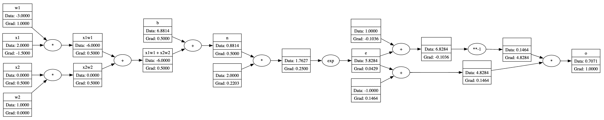

# tinytorch
Autograd engine in python, inspired by [karpathy](https://github.com/karpathy/micrograd)'s micrograd

Implements backpropagation over a dynamically built DAG and a small neural networks library on top of it with a PyTorch-like API. Even though it has a small footprint, it is enough to build up entire deep neural nets doing binary classification.

## Features

- **Automatic Differentiation:** TinyTorch supports automatic differentiation through the computational graph, enabling easy backpropagation for training neural networks.
- **Modular Design:** Neural network layers and neurons are modularly implemented, making it easy to construct and customize different network architectures.
- **Visualization:** The library includes utilities to visualize the computational graph, aiding in debugging and understanding network operations.

## Installation

To install TinyTorch, clone this repository and install the required dependencies:
```bash
git clone https://github.com/crpatil1901/tinytorch.git
cd tinytorch
pip install -r requirements.txt
```

## Usage

The notebook example.ipynb provides a full demo of training an neural network (MLP) binary classifier on an example dataset. This is achieved by initializing a neural net from `tinytorch.net` module.

Below is an example usage of some basic operations and backpropagation.

```python
x1 = Value(2.0, label='x1')
x2 = Value(0.0, label='x2')

w1 = Value(-3.0, label='w1')
w2 = Value(1.0, label='w2')

b = Value(6.881373587, label='b')

x1w1 = x1*w1; x1w1.label = 'x1w1'
x2w2 = x2*w2; x2w2.label = 'x2w2'

x1w1x2w2 = x1w1 + x2w2; x1w1x2w2.label = 'x1w1 + x2w2'
n = x1w1x2w2 + b; n.label = 'n'

e = (2*n).exp(); e.label = 'e'
o = (e - 1) / (e + 1); o.label = 'o'

o.backward()
```

The graph generated can be visualised using the draw_dot() function from `tinytorch.viz` module.



## Todo

- [x] Implement efficient tanh
- [ ] Implement elu, relu, sigmoid, step function
- [ ] Implement log, loginv, trig func
- [ ] Fix recursion limit error
- [ ] Implement iterative backward to increase performance
